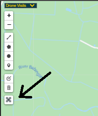
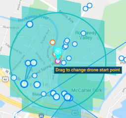

# IITC-Drone-Helper

#### Installation
* Requires [IITC CE](https://iitc.app/). 
* Use this link to [install Drone Helper](https://github.com/azrael-42/IITC-Drone-Helper/raw/main/dronehelper.user.js).
* Can use information about keys from [LiveInventory](https://github.com/EisFrei/IngressLiveInventory/) of the Keys plug-in available on the IITC site. (LiveInventory requires active C.O.R.E. subscription)

#### Unique Portals Drone Visited:
Manually record portals visited by your drone. Compare the number recorded with the in app count (sometimes the Ingress app doesn't update for several jumps, so restart if the count in the scanner looks low). Use the Drone Helper highlighter to see which portals you have already visited shown on the map. Uses sync plugin to keep other devices updated.

#### Drone View:
Activate the Drone View layer, and when you click on a portal the area your drone can "see" from there is shaded. A circle is drawn at 1.25km to mark the extra portals you can reach if you use a portal key to extend your range. This plugin uses L16 cells required to cover 500m circle. These options can be configured if you want to test other hypotheses for visible portals/maximum jump distance.

#### Drone Coverage:
  
Ensure the Drone Coverage layer is turned on, click on the drone icon on the left to activate the coverage tool. A marker will appear on the map, centred on the selected portal (if any). To start the coverage calculation, either click on the marker if you want to leave it on the portal or drag it to where you want to start.

If you have the LiveInventory or Keys plug-ins, you can choose to extend the coverage if you have keys that will help.

You can also choose to see where your drone could go if you had keys to every portal. This adds noticeably to the computation time required, especially in an area where there are a large number of portals that are not included in the coverage area.
#### Drone Route:
Ensure the Drone Route layer is active. Select a portal and click "Add to route" to add it to the route. "Show routes" brings up a list of portals - you can drag them to reorder the route or take portals out of the route. Configurable keyboard shortcuts (default to 'd' and 'r') are also available.

Choose if the route is coloured to show the type of jump between adjacent portals - a regular jump (green), a jump needing a key (amber), or a jump that is not possible (red). You can also use key information from the LiveInventory or Keys plug-ins to show routes requiring keys you already have in a more greeny yellow colour.

From the route list, you can save the current route as a named route, or manage your named routes, including saving to/loading from JSON files.

Your current route will be synced across your devices if you have the IITC Sync plugin.

#### Drone Distance:
Use the "Set Drone Start" while the starting portal is selected, and after that the plugin will display estimated flight distances for each portal you select. To match the behaviour in the scanner, the distance is truncated (floor function), so if the distance between start and current portal is actually 29.7km, the distance shown will only be 29km. For portals under 2km from the set start portal, the distance will be shown with 1 or 2 decimal places - this allows checking if a portal is within 1.25km of the chosen portal, and can be used to judge if a jump is possible with an appropriate key. 

#### Please note:
1. All configuration options can be accessed from the "DroneHelper Opts" dialog
2. Coverage mapping does not check for 1-way jumps - following the coverage tool it is possible to get stuck in an area, so if the jump you are making is outside the 500m circle, manually check you can get back again. 
3. If your key numbers reduce to 0 for a portal, or the keys plug-in refreshes all data due to sync information from a different device, the coverage tool will ask to start calculations again - it is unable to just remove the affected portal from the coverage.
4. Coverage calculations in central London, different zoom levels found that 7,000 portals took 17 seconds and 11,000 portals took 26 seconds. 